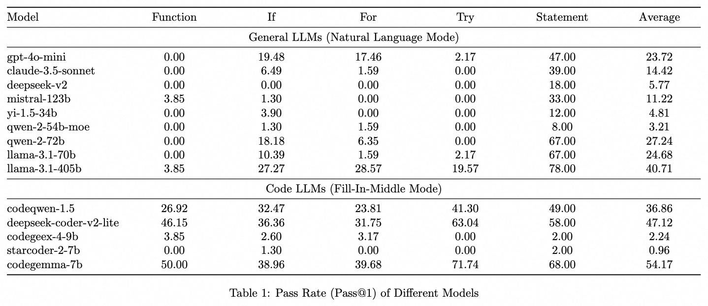

# Codev-Bench

## Introduction
Codev-Bench (Code Development Benchmark), a fine-grained, real-world, repository-level, and developer-centric evaluation framework. Codev-Bench assesses whether a code completion tool can accurately capture a developer's immediate intent and suggest appropriate code snippets across diverse, fine-grained contexts.

In daily IDE-based coding development scenarios, the user's real-time autocompletion needs are diverse. They not only include generating function according to comments but also encompass sub-scenes such as contextual completion for logical blocks, completion of function parameter lists, and completion of ordinary statements. Previous code generatino or completion benchmarks only focus on generating entire function according to comments, for example, [HumanEval](https://github.com/openai/human-eval), [MBPP](https://huggingface.co/datasets/google-research-datasets/mbpp), [ClassEval](https://github.com/FudanSELab/ClassEval), [LiveCodeBench](https://github.com/LiveCodeBench/LiveCodeBench), [EvoCodeBench](https://github.com/seketeam/EvoCodeBench), etc..

To better align with real user development scenarios, we propose Codev-Bench. It not only reproduces the diverse sub-scenes that users may encounter during their development process but also constructs unit tests-based evaluation method to more accurately assess the code quality generated by various LLMs.


## Methodology
In detail, first, We extract unit test classes and functions from real GitHub repositories and, complete the installation of environment dependencies and execute the unit tests with the assistance of GPT-4. At the same time, we deploy [pytest trace](https://docs.pytest.org/en/stable/) tool to extact the execution traces of unit tests to figure out the target functions related to each unit test. Finally, [tree-sitter](https://tree-sitter.github.io/tree-sitter/) is used to parse the AST (Abstract Syntax Tree) of the target functions, thus all the sub-functions, comments, logical blocks, statements, etc. can be recognized.

We split the completion sub-scenes or capabilities that users may encounter while developing in an IDE into the following parts:

> **Scene1**. &#9989; Completing complete code blocks (including functions, conditional logic blocks, loop logic blocks, comments, ordinary statements, etc.).

- **Scene1.1**. &#9989; The context of the code block to be completed is fully complete.

- **Scene1.2**. &#9989; The context of the code block to be completed has an empty body, but the external context of the function is complete.

- **Scene1.3**. &#9989; The context following the code block to be completed is completely empty.

> **Scene2**. &#9989; Completing a portion of code within a specific code block.

- **Scene2.1**. &#9989; Complete a portion of code within the code block.

- **Scene2.2**. &#9989; The code block is already complete and should not have any code added.

> **Scene3**. &#128260; Completing code based on classes and functions defined in other files.

> **Scene4**. &#128260; Completing code based on related and similar code within the project.


## How To Use

### Data

Reseachers and developers can download the source Github repositories [Source_Code.tar.gz](https://huggingface.co/datasets/TongyiLingma/CodevBench/resolve/main/Source_Code.tar.gz?download=true) and its copy version [Source_Code_Copy.tar.gz](https://huggingface.co/datasets/TongyiLingma/CodevBench/resolve/main/Source_Code_Copy.tar.gz?download=true). These repositories are obtained by [EvoCodeBench](https://github.com/seketeam/EvoCodeBench) and are created between Dec 2023 to Feb 2024. In the future, we will continuously crawl and analyze new repositories as the source repositories for evaluation.

All the file can be download as follows:
```
cd CodevBench

# download the code of source repositories
wget "https://huggingface.co/datasets/TongyiLingma/CodevBench/resolve/main/Source_Code.tar.gz?download=true" -O Source_Code.tar.gz
tar -zxvf Source_Code.tar.gz

# download the copy version of source repositories
wget "https://huggingface.co/datasets/TongyiLingma/CodevBench/resolve/main/Source_Code_Copy.tar.gz?download=true" -O Source_Code_Copy.tar.gz
tar -zxvf Source_Code_Copy.tar.gz

# download repositories' metadata (e.g. unit test paths, functions, target blocks, etc.)
wget "https://huggingface.co/datasets/TongyiLingma/CodevBench/resolve/main/metadatas.tar.gz?download=true" -O metadatas.tar.gz
tar -zxvf metadatas.tar.gz

# download the prompt of each completion question
wget "https://huggingface.co/datasets/TongyiLingma/CodevBench/resolve/main/prompts.tar.gz?download=true" -O prompts.tar.gz
tar -zxvf prompts.tar.gz

# download the predicted response of each LLMs and Code LLMs
wget "https://huggingface.co/datasets/TongyiLingma/CodevBench/resolve/main/predicts.tar.gz?download=true" -O predicts.tar.gz
tar -zxvf predicts.tar.gz
```

### Installation

We recommend reseachers and developers to use conda to create a virtual environment.

```
cd CodevBench
python3.10 -m venv myenv && source myenv/bin/activate
pip install pytest pandas tqdm fuzzywuzzy
```

Then, reseachers and developers can build the environment by running the following command.

```
bash create_env.sh
```

It will cost a few hours to build the execution environment.

### Validation

To validate whether the unit tests of each repository are executed successfully, you can run the following command.
```
myenv/bin/python src/prepare.py --method retest_block_unit_test --mode prefix_suffix_full_complete_current_block_no_evidence
```
If almost all the unit tests run successfully, reseachers and developers can proceed to the subsequent steps of calling the model for predictions and evaluations.

### Prompts

We split the completion sub-scenes or capabilities as follows:

**Scene1.1**: `./prompts/prefix_suffix_full_complete_current_block_no_evidence.jsonl` and `./prompts/prefix_suffix_full_complete_current_block_with_evidence.jsonl`

**Scene1.2**: `./prompts/prefix_full_suffix_func_empty_complete_current_block_no_evidence.jsonl` and `./prompts/prefix_full_suffix_func_empty_complete_current_block_with_evidence.jsonl`

**Scene1.3**: `./prompts/prefix_full_suffix_empty_complete_current_block_no_evidence.jsonl` and `./prompts/prefix_full_suffix_empty_complete_current_block_with_evidence.jsonl`

**Scene2.1**: `./prompts/complete_current_header_inner_block_completion.jsonl`

**Scene2.2**: `./prompts/complete_current_header_empty_completion.jsonl`

**Scene3**: Look forward to it.

**Scene4**: Look forward to it.

The structure of the prompts is as follows:
```
{
    "func_name": "function file path and line position",
    "item_dids": [
        "unit test ids"
    ],
    "unit_test_ids": [
        "unit test ids"
    ],
    "block_key": "target code block file path and line position",
    "block_type": "AST type of block",
    "prompt": "<filename>xxx<fim_prefix>xxx<fim_suffix>xxx<fim_middle>xxx",
    "prefix": "prefix context of target code block",
    "suffix": "suffix context of target code block",
    "middle": "ground truth of target code block",
    "test_prefix": "prefix context of to construct the unit test",
    "test_suffix": "suffix context of to construct the unit test",
    "test_middle": "ground truth of target code block to construct the unit test",
}
```

### Predictions

We provide the prefix context and suffix context in the prompt, thus users can call different model (general LLMs or code LLMs) to predict the completion of the target code block. 

For general LLMs, we provide the natural language version prompt template in `./src/templates/llm_template.py`, users can use this template to construct final prompt and call the model.

For code LLMs, users should construct the prompt according to the Fill-In-Middle template for the corresponding code LLMs and call the model. We also provide some calling examples in `/mnt/coai_nas/qianhu/github/completion_benchmark/src/request_model.py`.

The predicted responses are as follows:
```
{
    "func_name": "function file path and line position",
    "item_dids": [
        "unit test ids"
    ],
    "unit_test_ids": [
        "unit test ids"
    ],
    "block_key": "target code block file path and line position",
    "block_type": "AST type of block",
    "prompt": "<filename>xxx<fim_prefix>xxx<fim_suffix>xxx<fim_middle>xxx",
    "prefix": "prefix context of target code block",
    "suffix": "suffix context of target code block",
    "middle": "ground truth of target code block",
    "test_prefix": "prefix context of to construct the unit test",
    "test_suffix": "suffix context of to construct the unit test",
    "test_middle": "ground truth of target code block to construct the unit test",
    "response_original_text": "original response of the model",
    "response": "the parsed final target code for model to complete"
}
```

We provide some examples in `./predicts/prefix_suffix_full_complete_current_block_no_evidence/predictions/`.

### Evaluation

The final step is to fill the predicted code into the cursor position and run the corresponding unit tests.

After calling model and obtaining the predicted responses, we can run the following command to run the unit test:
```
myenv/bin/python src/evaluate.py --method evaluate_prediction --model codegemma_7b --mode prefix_suffix_full_complete_current_block_no_evidence --check-unittest
```

Thus, the result file `./predicts/prefix_suffix_full_complete_current_block_no_evidence/results/codegemma_7b.jsonl.x` will be generated. Then, users can use the following command to summarize the results:
```
myenv/bin/python src/evaluate.py --method print_scores --model codegemma_7b
```


## Experimental Results

We evaluate some popular general LLMs and code LLMs on the sub dataset **Scene1.1** of the CodevBench dataset. The results are as follows:

