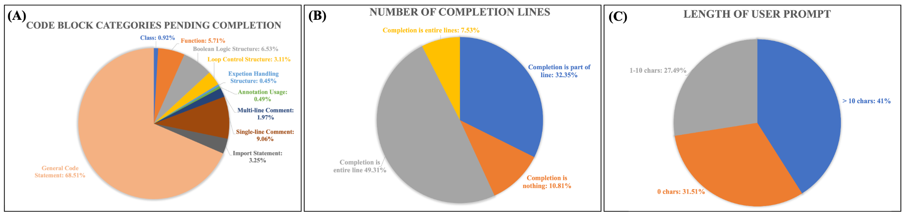
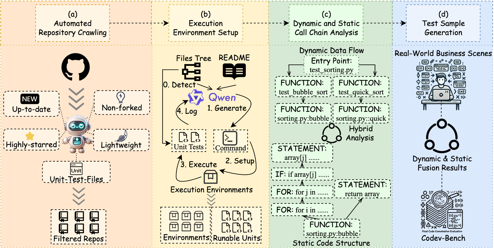
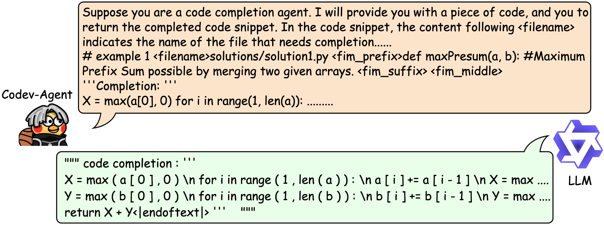
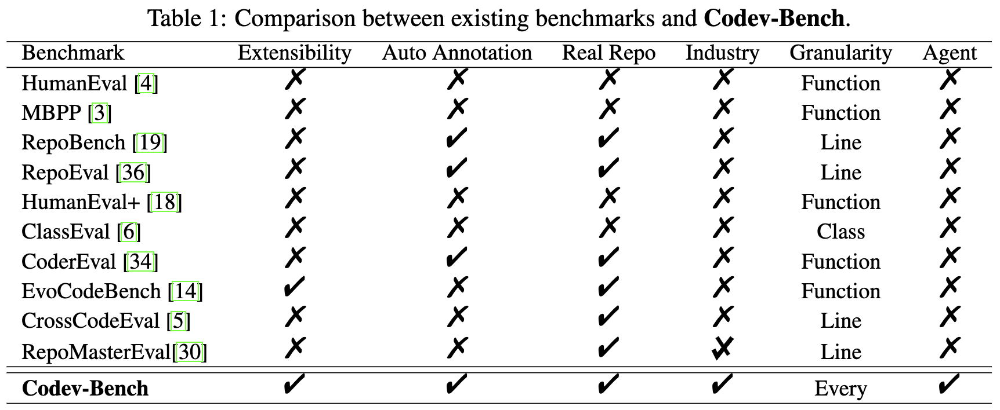
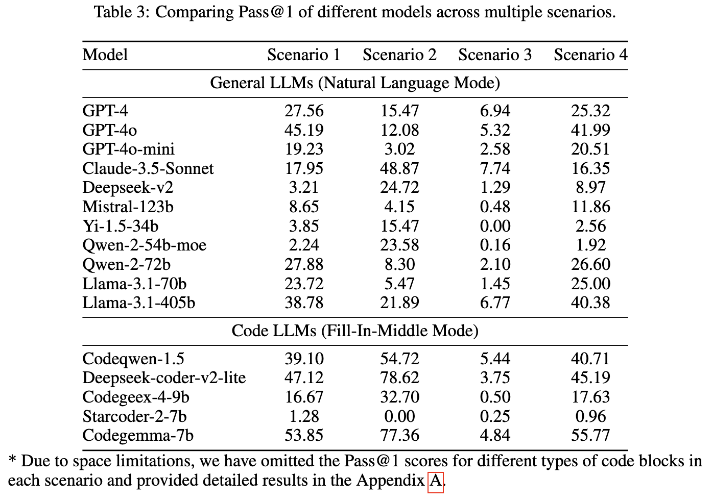
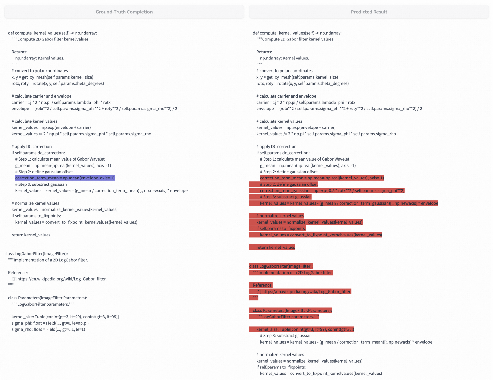
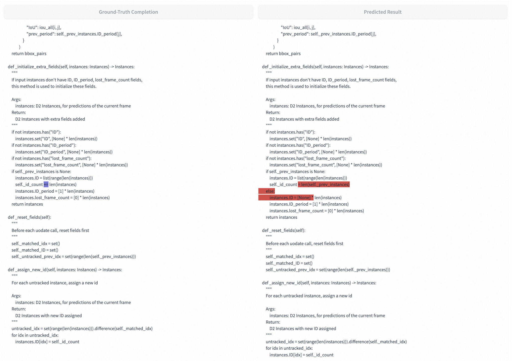
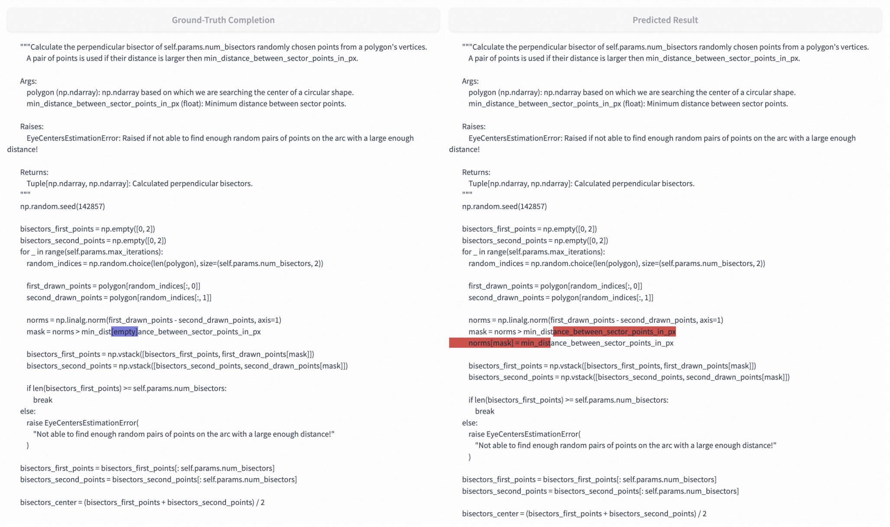

**论文标题：**

Codev-Bench: How Do LLMs Understand Develop-Centric Code Completion?

**论文作者：**

潘震宇，曹荣禹，曹永昌，马迎伟，黎槟华，黄非，刘晗，李永彬

**论文链接：**

📑 https://arxiv.org/abs/2410.01353

**Repo链接：**

🚀 https://github.com/LingmaTongyi/Codev-Bench

🤗 https://huggingface.co/datasets/TongyiLingma/CodevBench

# 摘要

代码补全是代码生成中的一个关键下游任务，也是提高软件开发中开发者生产力最频繁且影响最显著的方法之一。随着智能补全工具的不断发展，我们迫切需要一个强有力的评估基准，以便对不同产品进行有意义的比较并指导未来的改进。然而，现有的代码补全任务基准测试更多集中于粗粒度的代码补全，缺乏真实的业务场景分析，类似于常规代码生成任务，而非开发者在实际工作中遇到的补全场景。此外，这些基准测试通常依赖于高成本且耗时的人为标注，独立的测试案例未能利用最小化测试来最大化代码库级的理解和覆盖。
为了解决这些局限性，阿里巴巴通义实验室联合美国西北大学首先在分析了100位公司内部各领域开发者使用代码补全工具的行为习惯，并重新定义了评估标准，让评测更加符合开发者在整个编码过程中的意图和期望补全行为。我们还设计了 Codev-Agent，一个基于大模型的智能系统，自动进行代码库爬取、构建执行环境、从现有单元测试中提取动态调用链，并生成新的测试样本以避免数据泄漏，构造基于单测的评价系统，确保公平有效的对比。通过 Codev-Agent，我们发布了基准测试 Codev-Bench，一个细粒度、基于真实业务场景的代码库级别的以开发者为中心的评估框架。它能评估代码补全工具是否能够捕捉开发者的即时意图，并在不同上下文中提供合适的代码建议，为现代软件开发中的代码补全提供了更现实的评估基准。

# 背景介绍

在软件工程领域，代码大模型（Code LLM）如 Codeqwen、Codegeex 和 Starcoder 在代码生成方面表现出了强大的能力。同时，一些代码助手工具如 TONGYI 灵码和 Copilot 也开始将这些代码大模型集成到业务产品中，其中代码补全功能作为日常软件开发中最常用且最有效的功能之一，显著提升了开发者的生产力。面对各种工具的出现，对它们的性能进行全面对比的基准测试需求也愈加迫切。
研究者们已经发布了许多不同类型的基准测试数据集。然而，他们仍然存在三个关键挑战：(1) 任务粒度过于粗糙，缺乏真实业务场景，更多类似于常规代码生成任务，而非开发者在实际中面临的很多补全场景；(2) 可扩展性受限，由于数据样本和测试用例的人工标注费时费力，持续更新困难且缺乏灵活性；(3) 测试样本的独立生成未能充分利用最小测试以实现对代码库的最大理解和覆盖。
为了解决这些问题，研究团队首先分析了工业代码补全工具的用户反馈，重新定义了评估标准，更加贴近开发者的实际意图和编码过程中对补全的需求，解决了挑战 (1)。基于这些发现，研究团队设计了 Codev-Agent 来应对挑战 (2) 和 (3)。Codev-Agent 是一个基于LLM的智能系统，能够自动进行代码库爬取、执行环境构建、从现有单元测试中提取动态调用链，并结合代码静态分析生成新的测试样本，有效避免数据泄漏，确保对比的公平性和有效性。此外，它支持用户定制和优化，可以根据具体需求和场景灵活调整基准测试，比以往的方法更加全面。通过 Codev-Agent，研究团队提出了开发者为中心的评估数据集 Codev-Bench，这是一个细粒度、基于真实业务场景的代码库级评估框架，能够评估代码补全工具是否能准确捕捉开发者的即时意图，并在不同上下文中提供合适的代码建议，为现代软件开发中的代码补全提供更加真实和有针对性的评估。

# 业务场景分析

通过对100名前后端和算法开发者及外包程序员的使用行为进行为期一个月的分析，研究团队深入了解了开发者的真实需求和常见使用场景，设计出更加贴近实际开发环境的测试数据集，以实现更具现实意义的评估。这些分析揭示了用户在代码补全中的关键使用场景：
1. 待补全的代码块类别：大多数补全（约68.51%）针对的是通用代码语句，反映了开发者对广泛上下文感知的建议的需求。其他重要类别包括单行注释（9.06%）、函数（5.71%）和控制逻辑（6.53%）等结构。这些分布显示了开发者需求的多样性，以及测试数据集中覆盖广泛代码结构的重要性。
2. 补全行数：数据显示，在近一半的情况下（49.31%），助理完成了整行代码，另有相当大比例（32.35%）的补全涉及部分行。这表明开发者经常依赖代码助理完成整行代码或生成较大的代码块，强调了在不同代码长度和补全上下文中进行测试的重要性。
3. 用户提示长度：对于当前补全的代码块，41%的用户提示超过10个字符，这表明开发者通常提供详细的输入以指导代码补全。然而，也有提示包含较少字符甚至为空的情况（31.51%），这意味着代码助理需要具备灵活处理详细和简略输入的能力。因此，在设计测试时涵盖了从高度具体到模糊输入的多种提示条件。
对这些关键数据的分析确保了测试数据集能够紧密贴合真实世界的使用情况，覆盖广泛的代码补全场景、不同的补全长度以及用户输入的多样性。

# Codev-Agent

Codev-Agent 能够基于现有单元测试文件的动态数据流提取测试样本，最大程度减少人工参与，同时保持代码库选择、执行环境配置和测试样本提取的稳定性。
1. 自动化代码库爬取：基于四个标准的LLM 驱动的爬虫：1. 近四个月内创建的代码库，以确保数据时效性；2. 具有较高 star 数代码库，以保证社区关注度和项目的受欢迎程度；3. 扫描文件目录后，仅保留包含单元测试文件的代码库；4. 通过利用 Qwen 读取和分析 README 文件，筛选出轻量级配置环境的代码库，从而优化效率并降低复杂性。
2. 执行环境搭建：从爬取阶段收集合格的代码库及其关联的单元测试，采用迭代过程进行对应的执行环境安装。从每个代码库中检测并提取单元测试文件，然后使用 Qwen 分析 README 和 requirements 文件，生成当前环境所需的设置命令。初始设置后，运行提取的单元测试以验证是否无错误或警告地运行。如果测试未通过，根据日志和命令输出，重复设置过程，直到所有单元测试可执行。
3. 动态与静态调用链分析： 解析代码文件和单元测试，将其转化为静态抽象语法树（AST），同时追踪单元测试执行期间的动态数据流，生成对应的调用链。通过融合动态调用链与静态 AST，可以轻松提取单元测试执行过程中的特定场景。还能为代码库中缺少或没有单元测试的情况去人工设计最小化单元测试，从而高效提升基准测试。
4. 测试样本生成：获得动态调用链和静态 AST 结构后，为每个现实场景提取对应的测试样本。例如，当用户编写一个函数并完成函数头但尚未编写函数体时，我们可以通过移除函数体并重新运行单元测试，生成相应的提示并保存为测试样本。这样可以系统化地提取与实际业务场景相匹配的测试样本，用于模拟代码补全的真实使用场景。
5. 评估执行：在完成基准测试后，Codev-Agent 会向每个待评估的 LLM 提供标准提示并生成推荐代码片段，然后在其各自的环境中执行相应的单元测试。如果测试通过，则结果为正；否则为负。Codev-Agent 依次测试每个场景，以得出最终评估结果。

# Codev-Bench

本文最终提出，Codev-Bench 是一个面向开发者的代码补全基准测试，旨在提供真实世界的代码补全场景并评估代码助手工具的性能。
- 高扩展性：Codev-Bench 使用 Codev-Agent 的动态-静态分析模块，直接从数据流中提取样本，极大减少了人工成本，并可轻松扩展到缺乏单元测试的代码库。
- 自动化注释：无需人工或 LLM 介入，Codev-Bench 自动从现有单元测试的动态数据流中提取注释，确保所有注释自动生成。
- 以开发者为本且具备业务场景分析：Codev-Bench 基于开发者的反馈构建，分析了行业真实代码补全工具的使用情况，确保基准测试贴近实际开发需求。
- 任务粒度细致：相比于之前的数据集，Codev-Bench 涵盖了从逻辑块（如 if、for、while）到单个语句、注释和参数列表补全等多种任务，真实反映了开发中的代码补全需求。
- 代理集成：Codev-Bench 完全集成了 Codev-Agent，自动化整个过程，包括代码库爬取、执行环境搭建、调用链分析、场景样本提取和 LLM 评估，支持用户自定义和优化，具有极高的适应性和全面性。

# 实验结果

## 总体结果

本文设计了四种不同的代码补全场景，以全面评估 Code LLM 和通用 LLM 的代码生成能力。并采用了 Pass@1 和编辑相似度（Edit Similarity, ES）作为主要评估指标，以衡量模型生成有效、可执行代码补全的能力。
我们对比了主流的通用LLMs（例如GPT-4系列、Claude系列、Qwen系列等）和代码LLMs（Codeqwen、deepseek-coder、CodeGemma等）。
1. 完整代码块补全（场景 1）：要求模型在完整的上下文中补全整个代码块（如函数、if、for、try 等），并准确停在正确的位置，通过单元测试来验证补全的正确性。实验结果表明，Code LLM 在完成函数和逻辑块等复杂代码块方面表现优于通用 LLM，但在生成完整的函数体和逻辑块时仍有改进空间。发现：较简单代码块（如单个语句）更容易完成，而函数体和逻辑块等复杂结构对于所有模型仍然具有挑战性。
2. 内部代码块补全（场景 2）：要求模型补全部分代码块，同时在 20% 的样本中评估模型识别当前代码块已完整且无需进一步补全的能力。实验结果显示，Code LLM 在内部代码块补全任务中的表现显著优于通用 LLM，尤其是在处理复杂代码结构方面，显示出对内部上下文的更高敏感度。发现：Code LLM 更能够识别何时需要补全代码以及何时代码已完成，无需进一步补全。
3. 不完整后缀补全（场景 3）：测试模型在当前光标后缀内容不完整的情况下补全代码的能力，包括文件中所有后缀内容为空和仅函数体内内容缺失的子场景。实验结果表明，无论是通用 LLM 还是 Code LLM，在不完整后缀补全场景中的表现均较差，尤其是对复杂结构的补全，表明该任务在缺少未来上下文的情况下具有挑战性。发现：缺少后续上下文信息时，模型在补全复杂结构方面表现不佳，这也是实际用户在代码补全工具中常遇到的挑战之一。
4. 基于 RAG 的补全（场景 4）：结合检索增强生成模块，通过检索代码库中的相似函数，向模型提供提示以指导代码生成。实验结果显示，Code LLM 能更好地利用检索增强生成（RAG）来进行代码补全，尤其是在跨文件引用代码片段的场景中，表现出更高的有效性。发现：Code LLM 能有效利用从其他文件检索到的相似代码片段来指导补全，这使得模型在实际项目级代码开发中更加有用。

## case study

通过分析bad case，我们发现了一些模型的普遍错误，包括无法在正确的位置停止、未能识别补全内容应在同一个代码块内补全、以及无法识别何时不应该补全任何内容等。

在这个例子中，模型预测的目标语句是“correction_term_mean = np.mean(np.real(kernel_values, axis=-1))”，然而，某些模型虽然正确地补全了该行代码，但是仍然会继续生成其他代码行，这导致单元测试无法通过。也就是说，这个模型遇到了在适当位置停止生成内容的困难。

在这个示例中，模型只需要预测“+=”符号来补全代码块中的代码“self._id_count += len(instances)”。然而，该模型却预测了“ = len(self._prev_instances)”，并接着写了一个新的“else”代码块。这个错误表明，模型未能识别这种补全应该在同一个代码块内补全。

在这个示例中，“mask = norms > min_distance_between_sector_points_in_px”已经写了完整的代码，因此模型只需要预测为空即可。然而，该模型仍然预测了两行代码。尽管这些预测没有语法错误，但它们可能会对用户造成显著的干扰，并导致单元测试无法通过。这种类型的错误表明，模型在识别何时不应该补全任何内容时存在困难。

# 结语

代码补全任务已经逐渐成为大模型应用的热门场景之一，在智能编码助手中，越来越多的用户使用代码自动补全工具帮助他们提升开发效率和编程幸福感，这也使得代码补全任务越来越具有挑战性，不仅涉及各个语言各个框架，而且使用场景也越来越丰富多样，为了持续地提升代码补全模型的能力，代码补全测试集也越发重要，如何站在用户角度，提出丰富、全面、客观、精准的代码补全测试集，应该是一项持续性的工作，我们也以此为目标，后续也希望不断加强Codev-Bench的覆盖范围，包括扩充多种编程语言、丰富补全场景等，希望我们构建的Codev-Bench能帮助不断提升代码补全模型的能力，从而为智能编码助手的用户带来更佳的体验。

